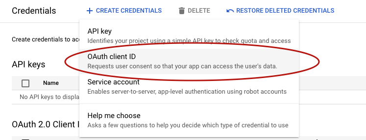
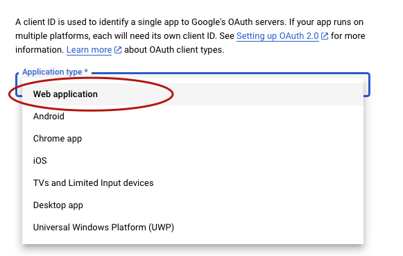
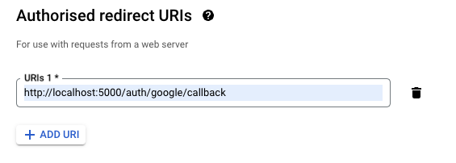
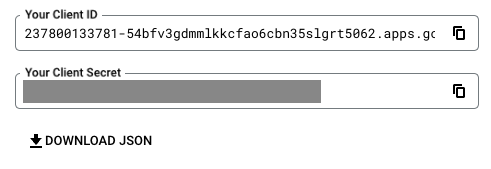
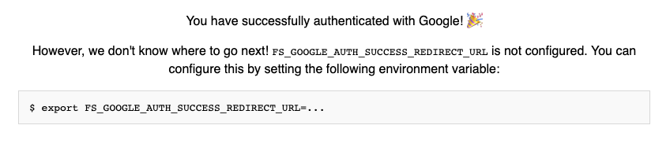

# Authentication

FireSync provides user registration and authentication out of the box. In this tutorial we will use Google as an authentication provider, but if you want to connect to an existing authentication system that you already have, check out our guide on [using your own backend](../guides/authentication/your-own).

## Create Google OAuth Credentials

To authenticate your users using Google, you need to [create some Google OAuth Client Id credentials](https://developers.google.com/workspace/guides/create-credentials#oauth-client-id). You can do this in the [Google Cloud Console](https://console.cloud.google.com/apis/credentials). You should create Credentials with the type 'OAuth Client ID':



You will be prompted for the application type, and should select *Web Application*:



Fill in the name of your application - you can put anything here so *'FireSync Todo List'* would be appropriate. 

In the *Authorised redirect URIs* section, you will need to add `http://localhost:5000/auth/google/callback`, to let Google know that it is safe to redirect back to FireSync after the user has authenticated with Google:



Press 'Create' to set up your credentials, and you will be shown your Client ID and Secret:



Make note of these values, and add them to your `.envrc` file to let FireSync know what they are:

```sh title=firesync-todo-list/.envrc
$ export FS_GOOGLE_AUTH_CLIENT_ID=...
$ export FS_GOOGLE_AUTH_CLIENT_SECRET=...
```

Restart the FireSync server to make sure it has picked up these changes:

```sh
$ npx @firesync/server server
```

## Testing Google Auth

To check that Google Auth is correctly set up, navigate to [http://localhost:5000/auth/google](http://localhost:5000/auth/google). You should be redirect to Google to log in with your Google account. After you have given permission to log in via Google, you should be redirected back to FireSync:



As you can see from the message, we've successfully authenticated with Google, but don't have anywhere to navigate to afterwards. We haven't set up a front-end app to go back to after authentication yet, but let's set `FS_GOOGLE_AUTH_SUCCESS_REDIRECT_URL` to `http://localhost:3000` in preparation for doing this in the next section:


```sh title=firesync-todo-list/.envrc
$ export FS_GOOGLE_AUTH_SUCCESS_REDIRECT_URL=http://localhost:3000
```
