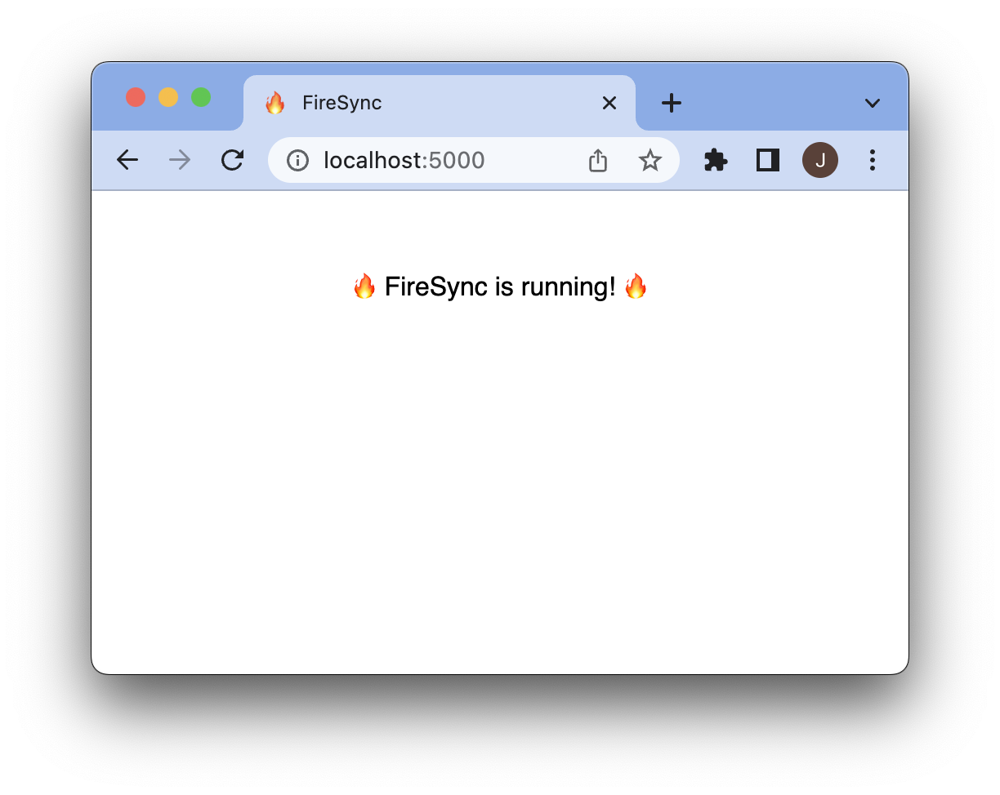

# Set up FireSync server

## Installing @firesync/server

Let's start by creating a directory for your todo list app:

```sh
$ mkdir firesync-todo-list
$ cd firesync-todo-list
```

Within this directory, install the `@firesync/server` `npm` package, which contains the code to run the FireSync server as a backend to your application:

```
$ npm install `@firesync/server`
```

You should find that this has created a folder called `node_modules` with `@firesync/server` inside.

## Setting up PostgresSQL

FireSync uses the [PostgreSQL](https://www.postgresql.org/) database to store your application's data in, so you will need a PostgreSQL database running locally that FireSync can access. If you have Docker installed, the easiest way is to use the `postgres` Docker image:

```
docker run --name firesync-postgres -e POSTGRES_PASSWORD=postgres POSTGRES_DATABASE=firesync -d -p 5432:5432 postgres
```

This will set up a PostgresSQL database running on `localhost:5432` with a database called `firesync`, and a user called `postgres` with password of `postgres`. These are the default values FireSync uses if no configuration is provided.

If you are running PostgreSQL in a different way, then you can tell FireSync how to connect to it by setting some environment variables:

```sh
$ export FS_POSTGRES_USER=postgres
$ export FS_POSTGRES_PASSWORD=postgres
$ export FS_POSTGRES_HOST=localhost
$ export FS_POSTGRES_DATABASE=firesync
$ export FS_POSTGRES_PORT=5432
```

:::tip

You can set environment variables in directly in your terminal, but they will only persist while your terminal is open. To save the config between sessions, write it into a `.envrc` file which FireSync will read on start up if it's present:

```sh title=firesync-todo-list/.envrc
export FS_POSTGRES_USER=postgres
export FS_POSTGRES_PASSWORD=postgres
export FS_POSTGRES_HOST=localhost
export FS_POSTGRES_DATABASE=firesync
export FS_POSTGRES_PORT=5432
```

:::

:::warning

TODO: Actually read from `.envrc` without `direnv`

:::

## Initialize Database schema

Before running FireSync, we need to create the tables in the database that it needs, and seed some initial data. You do this with the `setup` command to the `@firesync/server` CLI:

```sh
$ npx @firesync/server setup
```

You should see some output like:

```
Current migration version none
Running migrations
Now on migration version 20230303085114
Creating default project
```

## Running FireSync

With FireSync installed and the database set up, we can run the FireSync server:

```
$ npx @firesync/server server
```

FireSync will be running on `localhost` at port `5000`: [http://localhost:5000](http://localhost:5000).

You should see a success message to let you know FireSync is successfully set up and running:

